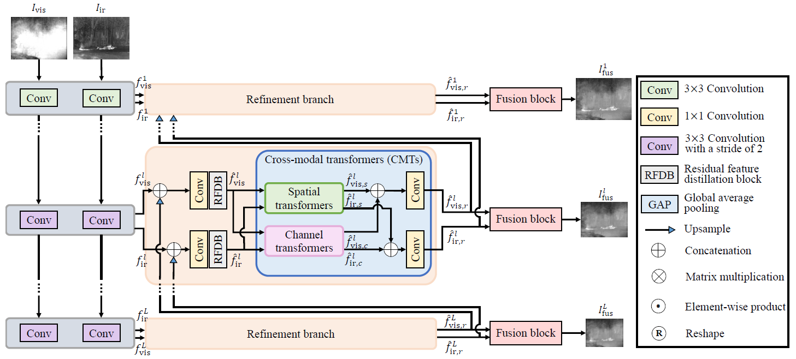

# CMTFusion

### Seonghyun Park, An Gia Vien, and Chul Lee
Official pytorch implementation for **"Cross-Modal Transformers for Infrared and Visible Image Fusion"**

<p float="left">
  &emsp;&emsp; 
</p>

## Preparation
### Testing samples: [Download from GoogleDrive](https://drive.google.com/drive/folders/1OPXJ3LjO7h49OoYZ7I0neuxYLjGO8A_-)
The ZIP file contains three test datasets:
- KAIST dataset: 200 image pairs
- TNO dataset: 20 image pairs
- RoadScene dataset: 221 image pairs
- M3FD dataset: 300 image pairs
### Pretrained weights: [Download from GoogleDrive](https://drive.google.com/file/d/1-yfpwxfntbwmsY8mTeYAqacowE_lL7h4/view)
The ZIP file contains pretrained weight file

## Citation
If you find this work useful for your research, please consider citing our paper:
```
@article{park2023_CMTFusion,
  title={Cross-Modal Transformers for Infrared and Visible Image Fusion},
  author={Park, Seonghyun and Vien, An Gia and Lee, Chul},
  journal={IEEE Transactions on Circuits and Systems for Video Technology},
  year={2023},
  volume={},
  number={},
  pages={},
  doi={10.1109/TCSVT.2023.3289170}}
```

## License
See [MIT License](https://github.com/seonghyun0108/CMTFusion/blob/main/LICENSE)
